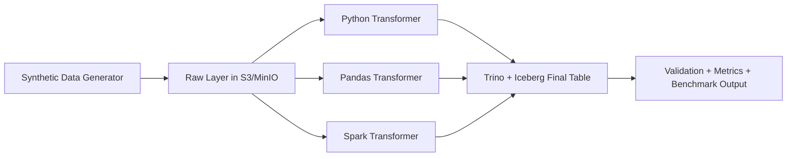

# Lakehouse Processing Benchmark

## Overview

This repository is an architecture-focused benchmark for comparing data transformation strategies in a lakehouse pipeline. It evaluates how different engines behave under increasing data volumes while keeping ingestion, storage, and persistence consistent.

## What this project is (and is not)

This is not a performance benchmark in isolation.

It is an architectural experiment designed to observe how different transformation strategies behave under controlled conditions.

The goal is not to prescribe a "best" engine, but to make trade-offs visible and measurable across different data volumes and execution models.

## Problem

Choosing the right transformation engine is a core data platform decision:

- Simple engines have low startup overhead but limited scalability.
- Distributed engines scale better but add operational complexity.
- The same persistence target can produce very different end-to-end latencies depending on the chosen execution strategy.

This project helps make that decision explicit through repeatable benchmark runs.

## Architecture

Main components:

- **Data generator**: creates synthetic transactional events.
- **Raw layer ingestion**: writes parquet batches to object storage.
- **Transformation engines**: `python`, `pandas`, and `spark`.
- **Storage and persistence**: object storage + Iceberg tables persisted through Trino.
- **Benchmark orchestration**: executes scenarios by engine and row volume, collecting runtime outcomes.



## Design Decisions

- Multiple engines are implemented to compare practical trade-offs with the same dataset contract.
- Factory + base classes keep the transformation layer extensible without changing ingestion or persistence flow.
- Modular package boundaries (`ingestion`, `transformation`, `benchmark`, `cleanup`, `spark`, `trino`) make architecture decisions visible in code structure.
- Synthetic data generation prevents confidentiality risks and keeps experiments reproducible.

## Trade-offs

- **Python**: lowest overhead, best for very small batches, memory-bound as data grows.
- **Pandas**: strong performance for moderate volumes on a single node, still memory-bound at large scale.
- **Spark**: highest startup and orchestration overhead, but designed for horizontal scalability and larger workloads.

## Results

Benchmark output is logged per run with:

- Rows requested
- Rows written
- Execution time
- Status (`SUCCESS`, `TIMEOUT`, `ERROR`, or `PARTIAL`)

Example format:

```text
python | rows=5000 | time=4.21s | status=SUCCESS | written=5000
pandas | rows=5000 | time=2.87s | status=SUCCESS | written=5000
spark  | rows=50000 | time=24.65s | status=SUCCESS | written=50000
```

## Tech Stack

- Python
- Pandas
- Apache Spark
- Trino
- Iceberg
- MinIO / S3-compatible object storage

## How to Run

1. Copy environment template values:

```bash
cp .env.example .env
```

2. Run the ingestion/transformation pipeline:

```bash
python jobs/ingest.py
```

3. Run benchmark mode:

```bash
python jobs/benchmark.py
```
